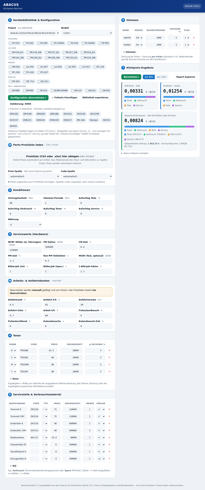

# Abacus Klickpreis-Rechner

Ein schlanker, eigenständiger Web-Rechner, der das Kostenmodell des **Konica Minolta
„Abacus for Distributors"** (Build 171) nachbildet. Man lädt einen **Foliant** (das
Konfigurations-PDF eines bizhub-Geräts) und berechnet damit direkt die **Klickpreise**
(S/W- und Farbklick) inklusive Aufschlüsselung nach Toner, Verbrauchsmaterial,
Serviceteilen und Service/Arbeit.

> Alles läuft lokal im Browser – keine Installation, kein Server, keine Datenübertragung.
> `index.html` einfach doppelklicken.



---

## Was ist der Abacus – und was macht dieser Rechner?

Der originale **Abacus** ist ein interaktives PDF-Formular mit eingebettetem JavaScript.
Distributoren laden darin einen **Foliant** und kalkulieren die Total-Cost-of-Ownership
bzw. den Klickpreis eines Geräts. Der Ablauf im Abacus:

1. **OPEN / IMPORT FOLIANT** – Foliant-PDF laden (enthält die Geräte- und Teiledatenbank).
2. **SERVICE VALUES** – Servicewerte (MCBV/MCBF, PM-Zyklus, Zeiten, Arbeits-/Anfahrtskosten).
3. **CONDITIONS** – Konditionen (Laufzeit, Aufschläge auf Teile/Verbrauch/Toner/Service).
4. **VOLUMES** – Druckvolumen definieren (Bilder/Monat, Farbe, Deckung, Medium, Plexität).
5. **CALCULATE** – Toner-, Verbrauchs-, Teile- und Servicekosten → **Klickpreis**.

Dieser Rechner bildet exakt diese fünf Schritte nach. Die Rechenformeln wurden **1:1 aus
dem eingebetteten Abacus-JavaScript übernommen** (Funktionen `calcVolumeValues()` und
`calcVolumeModuleValues()`). Details siehe [`docs/abacus-analyse.md`](docs/abacus-analyse.md).

---

## Gerätebibliothek – Foliants im Ordner lassen

Damit du Foliants **nicht bei jedem Start neu laden** musst, gibt es eine
**Bibliothek**, die beim Öffnen automatisch vorgeladen wird:

- Lege deine Foliant-PDFs und (optional) eine Preisliste in den Ordner **`foliants/`**.
- Erzeuge einmalig die Bibliotheksdatei:  `python3 tools/build-library.py`
  → schreibt `data/library.js`, das der Rechner beim Start lädt (offline, jede
  Browser-Engine).
- Ab dann sind **alle Foliant-Infos vorgeladen**: In Abschnitt 1 wählst du
  **Foliant → Modell → Optionen** und klickst **Konfiguration übernehmen**.

Ohne Python geht es auch komplett im Browser: **„＋ Foliants hinzufügen"** liest
die PDFs direkt ein und speichert die Bibliothek **im Browser** (localStorage) –
bleibt also über Sitzungen erhalten. Mit **„Bibliothek exportieren"** lädst du
eine `library.js` herunter, die du nach `data/` legen und einchecken kannst.

### Gerät & Konfiguration
- **Modell** wählen (z. B. C251i … C751i) → setzt automatisch die passende
  Toner-/Trommel-/Entwickler-Generation (TN328/TN626/TN715 …) und Richtwerte für
  die Servicewerte.
- **Optionen** ankreuzen (Finisher, Locher, Papier, Einzug, Fax) → Finisher fügen
  z. B. die zugehörige Heftklammer als Verbrauchsposition hinzu.
- Preise werden – sofern eine Preisliste geladen ist – **automatisch** zugeordnet.

---

## Benutzung

1. `index.html` im Browser öffnen (Doppelklick genügt).
2. **Gerät konfigurieren** (Abschnitt 1) – Foliant, Modell und Optionen wählen,
   dann **Konfiguration übernehmen**. Der Foliant liefert Maschinen-Kennung,
   Toner-Codes (TN…) und Verbrauchsmaterial (DR…, DV…, WX…) vorbelegt.
3. **Parts-Preisliste laden** (Abschnitt 1b) – **CSV oder Excel (.xlsx)** ins Feld ziehen.
   Der Rechner erkennt die Code- und Preis-Spalte automatisch und ordnet die Preise per
   Artikel- bzw. Materialcode den Toner- und Teile-Zeilen zu. Passt die Auto-Erkennung
   nicht, lassen sich Code-/Preis-Spalte per Dropdown manuell wählen. Deutsche Zahlen
   (`1.234,56`) werden korrekt gelesen.
4. **Konditionen, Servicewerte, Volumen** anpassen.
5. **Arbeits- & Anfahrtskosten** (Abschnitt 3b) sind **rein manuell** und werden von
   keinem Import (Foliant oder Preisliste) überschrieben.
6. **Berechnen** → Klickpreise pro Volumen und Gesamt-Ø, umschaltbar *pro Bild* / *pro 1000*.
   Über „Abacus-Report anzeigen" gibt es die textuelle Kostenaufstellung wie im Original.

### Preisliste – erwartetes Format
Eine Spalte mit **Artikel-/Materialcode** (Überschrift wie *Code, Artikel, Material, Nr.*)
und eine mit **Preis** (*Preis, Price, EK, VK, Netto*). Beispiel-CSV:

```
Artikelcode;Bezeichnung;EK Preis
TN328K;Toner schwarz;62,50
DR316K;Trommel K;75,00
```
Gematcht wird gegen den **Kurzcode** (TN328K, DR316K) *und* den **Materialcode**
(AAV8150 …) – je nachdem, wie deine Liste geführt ist.

### Umschalter & Report
- **pro Bild / pro 1000** – Anzeige der Klickpreise.
- **Report kopieren** – kopiert die vollständige Kostenaufstellung in die Zwischenablage.

---

## Das Rechenmodell (Kurzfassung)

Für jedes Volumen werden aus den Bildern die Zähler abgeleitet
(`ci`=Bilder, `cs`=Blätter, `rl`=Referenzlänge/A4-Äquivalent, `ra`=Referenzfläche) und
über die Laufzeit (`calcPeriod/volumePeriod`) hochgerechnet.

| Kostenblock | Formel (aus dem Abacus) |
|---|---|
| **Serviceteile** | `Menge = floor(Volumen / (yspread·Ergiebigkeit)) · qty`, `Kosten = Preis·Menge`, dann `· ImgJobFaktor · (1+Aufschlag)`; abgerechnet inkl. `(1+Non-PM-Faktor)` |
| **Verbrauch** | wie Serviceteile (Trommel/Entwickler/Imaging-Unit) |
| **Toner** | pro Farbe: `Gebinde = gedruckte Bilder / Ergiebigkeit(Deckung)`, `Kosten = Gebinde·Preis/qty`; Ergiebigkeit skaliert invers mit der Deckung (KM-Referenzmodell) |
| **Service/Arbeit** | `MCBV = ⌈1/(1/MCBF + 1/PM-Zyklus)⌉`, `Besuche = ⌈Ref-Länge/MCBV⌉`; Kosten aus Anfahrtszeit, Anfahrtsstrecke, Arbeitszeit (CM+PM), Kulanzbesuchen |
| **Klickpreis** | `Gesamtkosten / Gesamtbilder`, je Volumen anteilig nach Referenzlänge |

Vollständige Herleitung inkl. der übernommenen Code-Zeilen: [`docs/abacus-analyse.md`](docs/abacus-analyse.md).

### Validierung

Der Abacus enthält eine durchgerechnete Beispielkonfiguration (bizhub 4000i / Modul
BH4422S), die als Prüfstein dient. Die Engine reproduziert deren Report **auf den Cent**:

| Position | Erwartet (Abacus) | Engine |
|---|---|---|
| Verbrauch | 83,10 € | **83,10 €** |
| Serviceteile (PM) | 107,29 € | **107,29 €** |
| Serviceteile abgerechnet (inkl. Non-PM 0,5) | 160,935 € | **160,935 €** |

Nachvollziehbar über den Button **„Validierung: bizhub 4000i"** bzw.
`node test/validate.cjs`.

---

## Projektstruktur

```
index.html                     Der Rechner (UI + Verdrahtung)
js/abacus-engine.js            Rechen-Engine (Abacus-Formeln, framework-frei)
js/abacus-config.js            Konfigurator: Modell/Optionen -> Toner-/Teile-Vorbelegung
js/pdf.min.js                  pdf.js – Foliant-Import (lokal gebündelt, offline)
js/pdf.worker.min.js           pdf.js Worker
js/xlsx.full.min.js            SheetJS – Excel-Preislisten-Import (lokal gebündelt)
foliants/                      Ablage für Foliant-PDFs + Preisliste
data/library.js                Vorgeladene Bibliothek (aus foliants/ erzeugt)
data/foliant-c251i-seed.json   Aus dem C251i-Foliant extrahierte Artikel-/Verbrauchscodes
tools/build-library.py         Erzeugt data/library.js aus dem Ordner foliants/
docs/abacus-analyse.md         Technische Analyse des Abacus (Datenmodell + Formeln)
test/validate.cjs              Validierung gegen das 4000i-Beispiel (Node)
```

---

## Grenzen / Hinweise

- **Preise und Ergiebigkeiten** sind im Foliant nicht enthalten – der Abacus zieht sie aus
  einer separaten Preisliste. Hier werden sie manuell eingetragen (Vorbelegungen sind
  klar als Beispielwerte markiert und zu überschreiben).
- Das Referenzmedium ist **A4** (`refMul = 1`), wie bei Klickverträgen üblich. Andere
  Medien lassen sich über den Referenzfaktor pro Volumen abbilden.
- Die Servicekosten-Formel ist wortgetreu übernommen; das im Abacus mitgelieferte
  Report-Beispiel wurde mit einem älteren Arbeits-/Anfahrtskostenstand gespeichert, daher
  weicht dort nur der Laborwert vom aktuellen Wertesatz ab (die Formel selbst stimmt).
